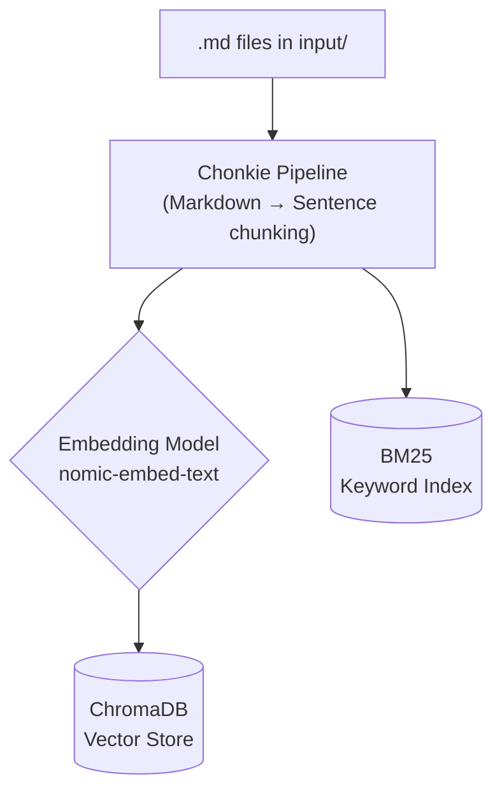
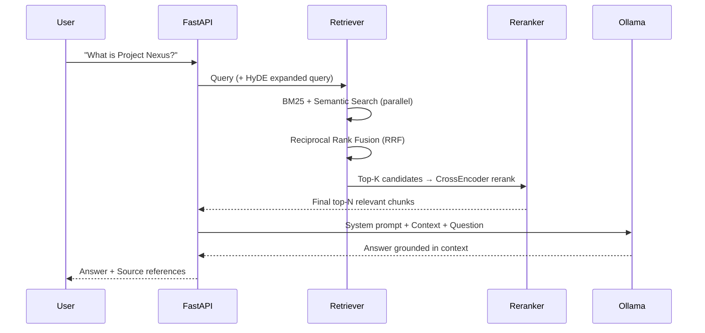

<div align="center">
  
</div>

<h1 align="center">LetsRag - Local RAG Studio</h1>

<p align="center">
  A production-grade, fully local Retrieval-Augmented Generation system. Free. Private. No cloud required.
</p>

<p align="center">
  <a href="#overview">Overview</a> •
  <a href="#demo">Demo</a> •
  <a href="#architecture">Architecture</a> •
  <a href="#evaluation">Evaluation</a> •
  <a href="#installation">Installation</a> •
  <a href="#running-the-project">Usage</a> •
  <a href="#configuration">Configuration</a> •
  <a href="#roadmap">Roadmap</a>
</p>

<p align="center">
  
  
  
  
  
</p>

---

## Overview

**LetsRag** is an open-source initiative by [Letsinnovate](https://letsinnovate.es) that provides a clean, well-engineered starting point for building a **Retrieval-Augmented Generation (RAG)** system that runs **100% locally**. No cloud tokens, no data sent to third-party servers, no costs.

The project is designed both as a **learning resource** (to understand all the moving parts of a production RAG pipeline) and as a **solid base** to extend for real use cases. It ships with a fully functional FastAPI backend, a chat UI, and a built-in DeepEval evaluation suite.

> **Key insight:** This project deliberately uses a smaller 8B local LLM to demonstrate an important principle: by engineering the *retrieval pipeline* correctly (chunking, hybrid search, reranking), you can dramatically improve the quality of the final answer without ever upgrading the model. Improving the LLM is always an option, but optimizing the retrieval layer is the right first step.

---

## Demo

<div align="center">
  <video src="https://github.com/user-attachments/assets/13eeb1cb-89be-4c7f-b288-88cf6baef08a" width="75%" controls autoplay loop muted>
    Your browser does not support the video tag.
  </video>
</div>


---

## Architecture

The system operates in two well-defined phases: **Ingestion** and **Retrieval/Chat**.

### 1. Ingestion Pipeline

When you drop `.md` files into the `input/` folder and run the ingestion script, the system parses them, applies a two-stage Markdown-aware chunking strategy (via **Chonkie**), generates dense vector embeddings, and stores everything in **ChromaDB**. A BM25 keyword index is also built in parallel for hybrid search.



### 2. Chat & Retrieval Pipeline

When a user asks a question, the system executes a sophisticated multi-stage retrieval strategy before the LLM ever sees the prompt.



### Retrieval Stack - In Detail

The retrieval pipeline is the true engine of this RAG system. A naive RAG just does a single vector similarity search, this project goes significantly further.

---

#### 1. Two-Stage Markdown-Aware Chunking (Chonkie Pipeline)

Before any retrieval can happen, documents must be split into meaningful pieces. Poor chunking is the single most common reason RAG systems produce bad answers. 

LetsRag uses a **two-stage pipeline** via [Chonkie](https://github.com/chonkie-ai/chonkie):
1. **Recursive Markdown chunking** - first splits by document structure (`#`, `##`, `###` headings), ensuring that logically related content stays together.
2. **Sentence-level refinement** - each structural block is then split at natural sentence boundaries (`.`, `!`, `?`, `\n\n`), guaranteeing that no sentence is cut mid-thought.

> Why it matters: a chunk that spans two unrelated sections is worse than useless - it contaminates the LLM's context with irrelevant text. Structure-first chunking eliminates this problem entirely.

---

#### 2. Hybrid Search: Semantic + BM25

LetsRag runs **two searches in parallel** for every query:

- **Semantic Search** (ChromaDB + `nomic-embed-text`): converts the query into a dense vector and finds the most *semantically similar* chunks - great for paraphrases and conceptual matches.
- **BM25 Keyword Search** (`rank-bm25`): a classic term-frequency algorithm that finds chunks containing the *exact words* in the query - great for proper nouns, model names, version numbers, and technical identifiers.

Neither search alone is sufficient. Semantic search misses exact-match cases; BM25 misses paraphrases. Together they achieve much higher recall than either approach individually.

---

#### 3. HyDE - Hypothetical Document Embeddings

Before searching, LetsRag uses the LLM to generate a **hypothetical ideal answer** to the query - even if that answer is completely made up. This hypothetical document is then embedded and used as the search query instead of the raw user question.

> Why it works: user questions are short and sparse. A hypothetical answer is longer, richer in vocabulary, and much closer in embedding space to the real document chunks that contain the answer. This dramatically improves recall for complex or abstract questions.

---

#### 4. Reciprocal Rank Fusion (RRF)

After the semantic and BM25 searches return their ranked lists of candidates, RRF merges them into a **single unified ranking** without needing to know the raw scores from each system (which are on different scales and incomparable).

RRF assigns each candidate a score of `1 / (rank + k)` in each list and sums them. Candidates that appear near the top of *both* lists get the highest combined scores and float to the top.

The weights are configurable in `config.yaml`:
```yaml
rrf_weight_semantic: 0.55
rrf_weight_bm25: 0.45
```

---

#### 5. CrossEncoder Reranker (`BAAI/bge-reranker-base`)

The final and most precise step. A **CrossEncoder** is a neural network that takes `(query, chunk)` pairs and outputs a relevance score by reading both texts together - unlike embeddings which encode query and chunk separately.

The top-K candidates from RRF are passed through the reranker, which re-scores them with this much deeper understanding of relevance. Only the top-N results (after reranking) are sent to the LLM.

> Why two stages? The CrossEncoder is accurate but slow. Running it on all documents is infeasible. Running it only on the top-K pre-filtered candidates gives you precision *and* speed.

---

| Component | Technology | Role |
|---|---|---|
| **Chunking** | Chonkie Pipeline (Markdown + Sentence) | Structure-aware document splitting |
| **Semantic Search** | ChromaDB + `nomic-embed-text` | Dense vector similarity |
| **Keyword Search** | BM25 (`rank-bm25`) | Exact term matching |
| **Query Expansion** | HyDE | Converts question to hypothetical answer for better recall |
| **Fusion** | Reciprocal Rank Fusion (RRF) | Merges semantic + BM25 rankings |
| **Reranker** | CrossEncoder `BAAI/bge-reranker-base` | Final precision re-scoring |


---

## Evaluation

Having a working RAG is only half the battle. Knowing it returns *factual*, *grounded* information is critical. LetsRag ships with a built-in evaluation pipeline powered by **[DeepEval](https://github.com/confident-ai/deepeval)**.

The evaluation suite lives in `eval/`:
- **`eval/dataset.json`**: Benchmark dataset with questions and expected answers derived from the `input/` documents.
- **`eval/evaluate.py`**: Runs the full RAG pipeline programmatically against every question and scores the results.
- **`eval/results.json`**: Detailed per-question report saved after each run.

### Metrics

| Metric | What it measures |
|---|---|
| **Faithfulness** | Does the LLM's answer stay faithful to the retrieved context? Penalizes hallucinations and contradictions. |
| **Answer Relevancy** | Does the answer directly address the user's question? Penalizes rambling or evasive responses. |
| **Contextual Recall** | Does the retriever surface the right documents? Penalizes retrieval gaps (search engine quality). |

> **Note on local evaluation:** When using a small local LLM (e.g., 7B) as the judge, automatic metrics can produce false negatives. For production evaluation, a larger judge model (GPT-4o, Claude 3.5 Sonnet, or Llama-3-70B) is strongly recommended. This is a known limitation of LLM-as-a-judge at small scale, not a flaw of the RAG pipeline itself.

```bash
# Run the full evaluation suite
PYTHONPATH=. python eval/evaluate.py
```

---

## Installation

### Prerequisites

- **Python 3.10+**
- **[Ollama](https://ollama.com/)** installed and running

### 1. Pull the required models

```bash
# Recommended LLM (best balance on Apple M-series / 16 GB RAM)
ollama pull llama3.1:8b

# Embedding model (required)
ollama pull nomic-embed-text
```

> You can use `qwen2.5:7b` or `mistral-nemo:12b` depending on your available RAM. See the [Configuration](#configuration) section.

### 2. Clone the repo and install dependencies

```bash
git clone https://github.com/your-repo/letsrag.git
cd letsrag

# Create and activate a virtual environment
python -m venv venv
source venv/bin/activate  # Windows: venv\Scripts\activate

pip install -r requirements.txt
```

---

## Running the Project

**Step 1: Add your documents**

Place any `.md` files you want the system to read into the `input/` directory.

**Step 2: Ingest the documents**

```bash
PYTHONPATH=. python rag_studio/ingestion.py
```

This will chunk the documents, generate embeddings, and populate ChromaDB.

**Step 3: Start the server**

```bash
PYTHONPATH=. python run.py
```

**Step 4: Chat**

Open your browser at `http://localhost:8000` and start asking questions about your documents.

---

## Configuration

All tuneable parameters live in a single `config.yaml` at the root. No Python code changes required.

```yaml
llm:
  model: "llama3.1:8b"          # Swap model here
  embedding_model: "litellm://ollama/nomic-embed-text"
  rerank_model: "BAAI/bge-reranker-base"

pipeline:
  chunk_size: 1024               # Tokens per chunk
  chunk_overlap: 128             # Overlap between chunks

retrieval:
  limit: 5                       # Chunks sent to the LLM
  top_k: 10                      # Candidates before reranking
  rerank_min_score: 0.1          # Minimum reranker confidence
  rrf_weight_semantic: 0.55      # RRF weight for vector search
  rrf_weight_bm25: 0.45          # RRF weight for BM25 keyword search
```

### Recommended Models by Hardware

| RAM | Recommended model | Notes |
|---|---|---|
| 8 GB | `qwen2.5:7b` | Minimum viable setup |
| 16 GB | `llama3.1:8b` ⭐ | Best price/quality on M-series |
| 32 GB | `mistral-nemo:12b` | Highest quality locally |

---

## Performance & Resource Footprint

LetsRag is designed to prove that a production-grade RAG doesn't require enterprise hardware.

- **LLM (`llama3.1:8b`)**: ~4.7 GB RAM
- **Embedding model (`nomic-embed-text`)**: ~275 MB
- **CrossEncoder reranker**: ~400 MB
- **ChromaDB (in-memory)**: < 100 MB for typical document sets
- **Full pipeline**: Runs comfortably on a MacBook M3 16 GB or any PC with 16 GB RAM

---

## Roadmap

- [x] Hybrid Search (BM25 + Semantic)
- [x] CrossEncoder Reranking
- [x] HyDE Query Expansion
- [x] Chonkie Markdown-aware Chunking
- [x] DeepEval Evaluation (Faithfulness + Relevancy + Contextual Recall)
- [ ] PDF / DOCX / XLSX document support
- [ ] Streaming responses in the UI
- [ ] Multi-collection (multi-tenant) support
- [ ] Docker Compose setup

---

## Credits

Built and maintained by [MrChuki](https://github.com/mrchuki) as part of the **Letsinnovate** open-source initiative.

If this project was useful to you, a ⭐ on GitHub would mean a lot.

---

*Built for the open-source community. 100% free, 100% local.*
